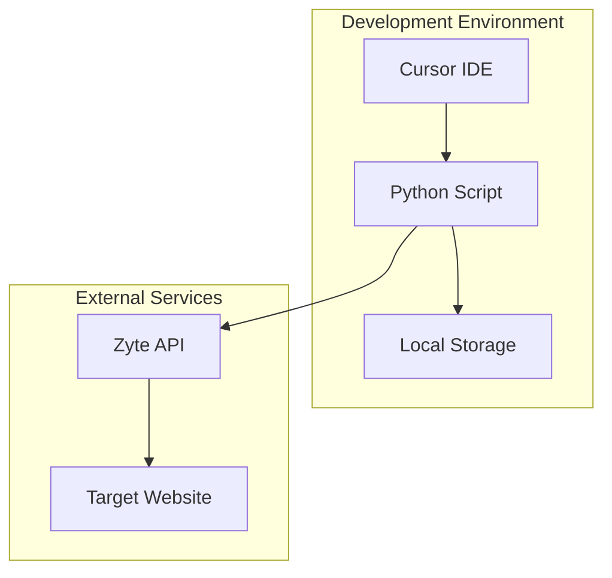
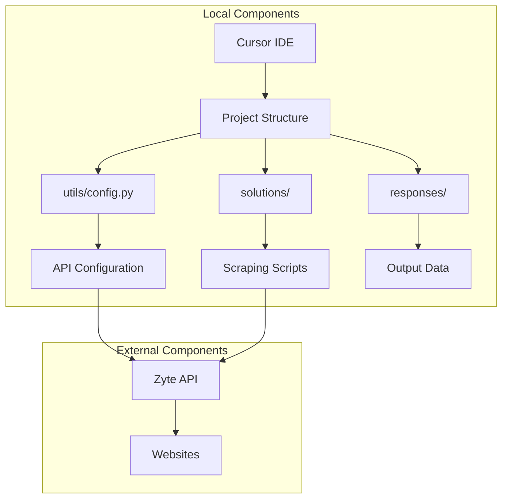
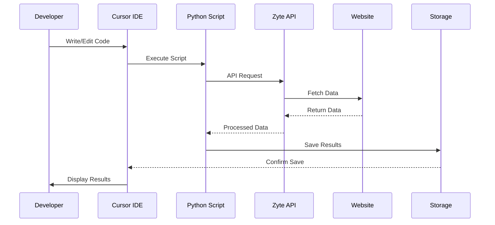
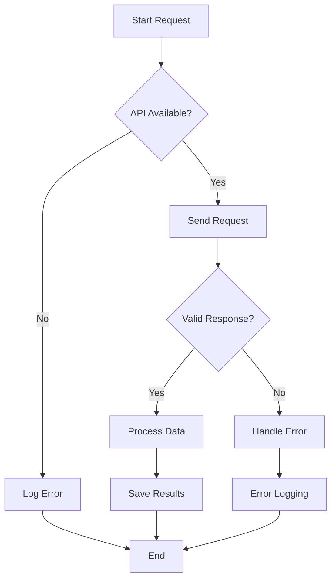
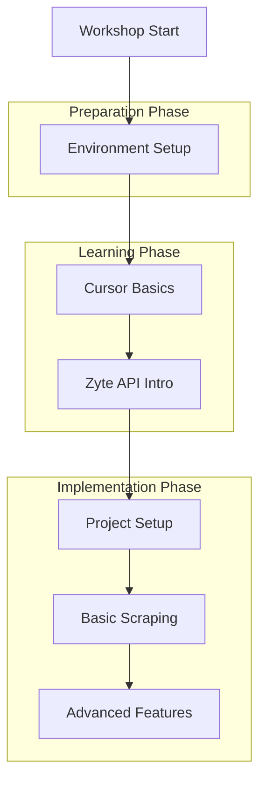
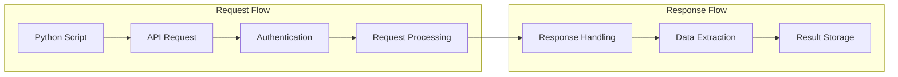

# Zyte API & Cursor Workshop - System Architecture

## 1. Overall System Architecture

## 2. Detailed Component Architecture

## 3. Data Flow Architecture

## 4. Error Handling Architecture

## 5. Workshop Flow Architecture

## 6. API Integration Architecture

## Architecture Components Description

### 1. Development Environment
- **Cursor IDE**
  - Primary development interface
  - Code editing and execution
  - Terminal integration
  - AI assistance features

- **Python Scripts**
  - Core scraping logic
  - API integration
  - Data processing
  - Error handling

- **Local Storage**
  - Configuration files
  - Output data
  - Logs and errors

### 2. External Services
- **Zyte API**
  - Browser automation
  - Data extraction
  - Request handling
  - Response processing

- **Target Websites**
  - Data sources
  - HTML content
  - Dynamic content
  - API endpoints

### 3. Data Flow
- **Request Path**
  - Script to API
  - Authentication
  - Parameter passing
  - Error handling

- **Response Path**
  - Data processing
  - Format conversion
  - Storage
  - Error logging

### 4. Error Handling
- **API Errors**
  - Authentication failures
  - Rate limiting
  - Invalid requests
  - Network issues

- **Processing Errors**
  - Data parsing
  - Format conversion
  - Storage issues
  - Validation failures

## Best Practices

### 1. Development
- Use version control
- Implement error handling
- Follow coding standards
- Document code

### 2. API Usage
- Implement rate limiting
- Handle authentication
- Validate responses
- Log errors

### 3. Data Management
- Secure storage
- Regular backups
- Data validation
- Cleanup routines

### 4. Performance
- Optimize requests
- Cache responses
- Batch processing
- Resource management 